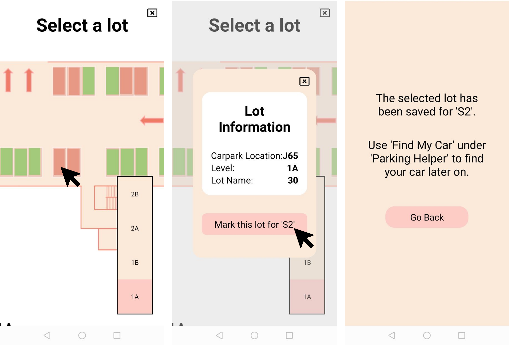

# Frontend for Park-Me

## About
Introducing “Park Me”, an all-in-one mobile application for public parking for motorists in Singapore. The parking spaces featured are managed by HDB, and will include common spaces such as open-air car parks near HDB estates, and multi-storey car parks (MSCPs). With the application, users will be able to:
1. quickly find available parking lots nearby (based on user location), within seconds
2. quickly find available parking lots near a specified postal code, within seconds
3. save the specified parking location of their vehicle
4. find their vehicle using their vehicle’s license plate number
5. efficiently provide feedback of a particular parking lot
6. review past feedback provided for a particular parking lot

The main page features a simple and easy-to-use user interface, allowing the user to quickly access the applications functionalities with just 3 buttons:
- Available Parking (functions 1 and 2)
- Parking Helper (functions 3 and 4)
- Provide Feedback  (functions 5 and 6)


### Available Parking - Find Parking Lots and Spaces
Users can key in a postal code or use their current location to find nearby parking spaces. Upon requesting to find available parking, the application will return the first ten nearest parking spaces within seconds, and can choose to scroll down for more options. The application will display the parking spaces’ address, distance away from user/specified postal code, and number of available parking lots within each parking space. Users can click the map icon to view the location of the parking space on the map.


Clicking on a chosen parking space will expand a drop down menu, allowing users to choose the parking space’s floor. For the application demonstration, the parking spaces will only feature 4 levels. Clicking on a chosen floor will bring the users to a floorplan of the parking space, where users can view the layout of the carpark. Green lots are available lots while red lots are unavailable. Users can also toggle across the different levels.


Users can click on any lot to view further details within a pop-up menu. These details include the carpark name (carpark code), the carpark floor/level, and lot name (lot number). On the pop-up menu, users can also quickly provide feedback and view past feedbacks on a given lot of choice.


### Parking Helper - Saving and Finding Car Location
(Note: Images should be view left to right, then top to bottom)




Users can key in their car’s license plate and choose a specific parking space. The finding of parking spaces is similar to the section above. Upon finding a parking space, users can select a specific parking lot to be marked as occupied by their car’s license plate. Only red lots can be selected as they are considered occupied. Once marked, a confirmation message will appear.


Users can proceed to the ‘Find My Car’ option in the main menu. Users simply need to key in their car’s license plate, and a prompt showing the address of the parking space and the specific parking lot number will appear. Users can also choose to view the parking lot on the car park’s layout, where the marked lot will appear as yellow.
Here, users can click on any lot to view further details within a pop-up menu. These details include the carpark name (carpark code), the carpark floor/level, and lot name (lot number). On the pop-up menu, users can also quickly provide feedback and view past feedbacks on a given lot of choice.


### Provide Feedback
Users can access the feedback menu from the main menu, or from viewing the carpark layout. Users can select a specific slot to provide feedback. A few default feedbacks include ‘Kerb issues’ and ‘Paint issues’. ‘Other’ feedbacks can be specified, such as parking issues. Multiple choices can be selected. Users will need to take a photo when providing feedbacks.


Upon submission of feedback, users will be prompted that their feedback has been recorded. Users can view a list of feedbacks by returning to the pop-up containing lot information. The feedback will list out the issue, the status, and the estimated time to rectify the issue.


## Potential Improvements
In the future, we can potentially introduce an admin menu where HDB officials can tend to feedbacks and provide responses. Furthermore, the current demo application only features one layout of parking lots; with more time, a variety of layouts can be introduced so that users can have a fun and interactive experience to locate specific lots in parking spaces. 


## To-Use
1. Install yarn using ```npm install --global yarn```
2. Clone the repository
3. Install dependencies using ```yarn``` or ```yarn install```
4. Start the front end using ```yarn start```
